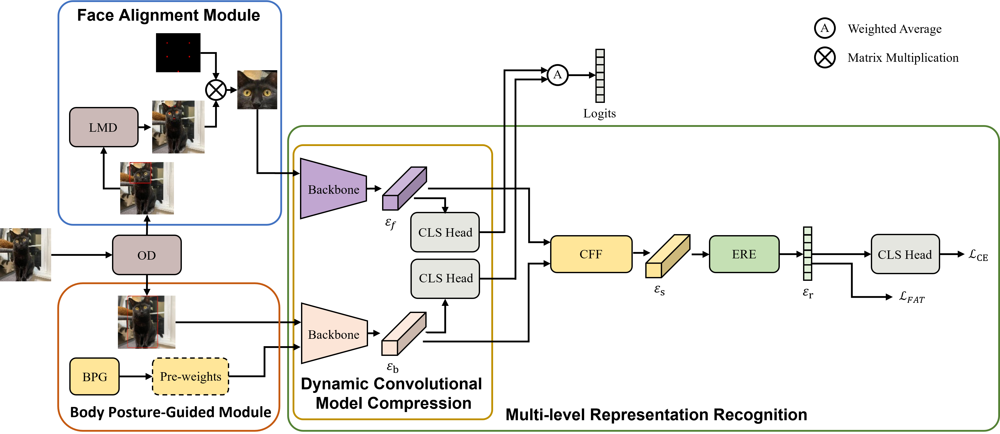
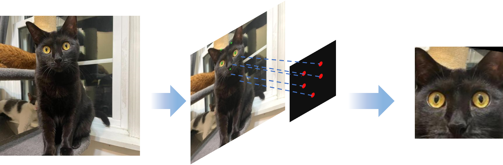
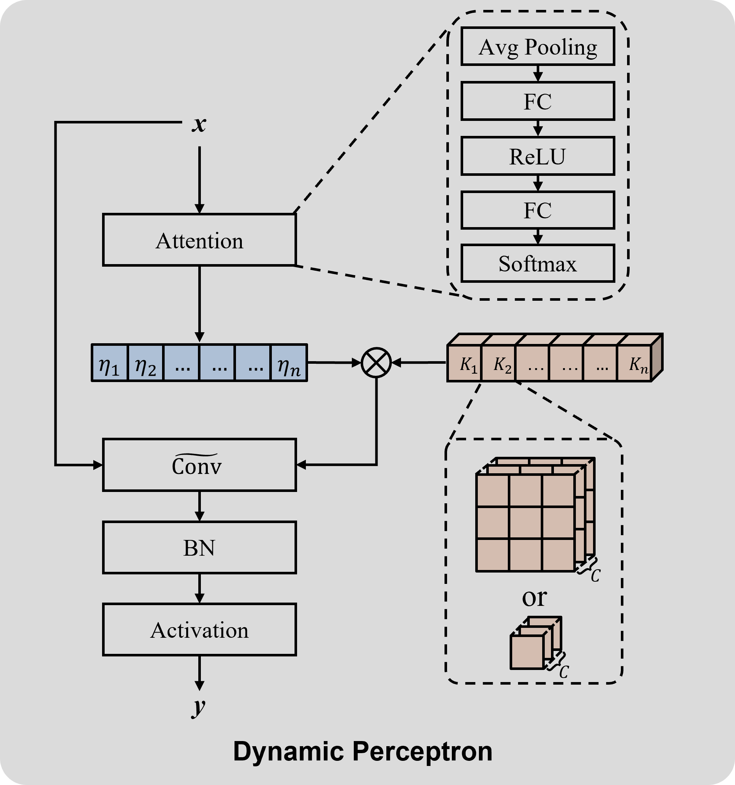
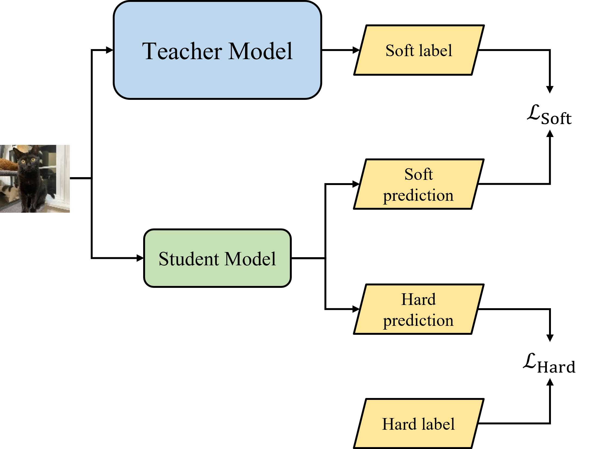
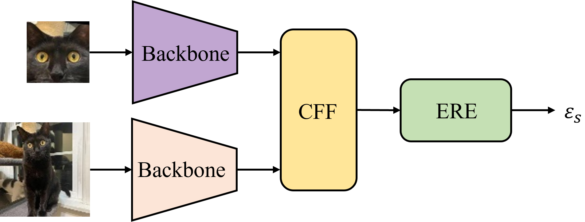
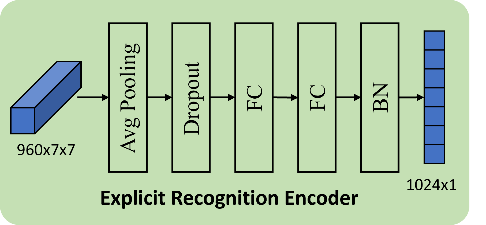
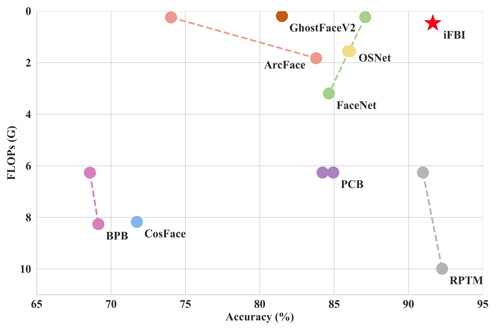

# iFBI: Lightweight Breed and Individual Recognition for Cats and Dogs

As the pet industry develops, fine-grained breed recognition and individual recognition are introduced to fulfill the need of pet monitoring system. They aim to identify the specific breed of a pet in an image and to recognize the same individual across multiple images, thereby providing a foundation for subsequent tasks such as pose recognition and emotion analysis. 

Despite the substantial advancements achieved in existing research, two critical issues remain to be solved: the diversity of object poses affects representation in complex scenarios, and the conflict between model complexity and performance hinders application in resource-constrained conditions.
To address the above issues, we propose an **i**ntegrated **F**ace-and-**B**ody **I**nformation for Lightweight Breed and Individual Recognition (iFBI) scheme that integrates multiple pose information by a lightweight model. 

Extensive experiments on two self-built datasets, Pet with Fine-grained Breed Dataset (Pet-FB) and Pet with Diverse Posture Dataset (Pet-DP), and four public datasets indicate that iFBI yields superior performance in both fine-grained breed recognition and individual recognition tasks.


## Overall Structure of Model




## Datasets

### Self-built Datasets

Pet-FB : https://pan.baidu.com/s/1EE6nUygFhP5ugCUSKdqbUg?pwd=f5mu

Pet-DP : https://pan.baidu.com/s/1P0hLO-NlKj6CSsYOdIfU2g?pwd=aptj

### Structure of Fine-grained Breed Recognition Dataset

iFBI currently supports fine-grained breed recognition datasets including Oxford-IIIT Pet, Tsinghua Dogs, Stanford Dogs and [Pet-FB](https://pan.baidu.com/s/1EE6nUygFhP5ugCUSKdqbUg?pwd=f5mu). Here is an example of Oxford-IIIT Pet:

```python
Oxford-IIIT Pet/
│
├── Oxford-IIIT Pet-txt/
│   ├── Abyssinian_1.txt
│   └── Abyssinian_10.txt
│
├── Abyssinian_1.jpg
├── Abyssinian_10.jpg
│ 
```

### Structure of Individual Recognition Dataset 

iFBI currently supports individual recognition datasets including DogFaceNet and [Pet-DP](https://pan.baidu.com/s/1P0hLO-NlKj6CSsYOdIfU2g?pwd=aptj). Here is an example of Pet-DP:

```python
Pet-DP/
│
├── 60003383/
│   ├── 0.png
│   └── 1.png
│
├── 60003384/
│   ├── 0.png
│   └── 1.png
│
├── coordinate.txt
├── landmark.txt
├── test.txt
└── train.txt
```


## Facial and Positional Preprocess

The aim of facial and positional preprocess is to eliminate the influence of factors such as pose change, light condition change and expression change on cat and dog recognition and analysis by preprocessing the original image and pre-training the model. Used in target detection network model including [YOLOv8](https://github.com/ultralytics/ultralytics), the [CenterNet](https://github.com/xingyizhou/CenterNet), and corresponding weights [download](https://pan.baidu.com/s/1oMH0-2jeYen3T8DBUf5hiQ?pwd=vnkr). (download storage paths for ` iFBI\image_processing\model `).


### Face Alignment

1. Detect face area  by YOLOv8
2. Detect facial landmarks by CenterNet
3. Align face landmarks with perspective changes by homologous transformation




### Body Posture-Guided Module

1. Detect body area by YOLOv8
2. Pre-train model backbone by BPG


## Model Training

Based on lightweight networks, fine-grained pet recognition technology can better adapt to the needs of various types of equipment, achieve efficient and accurate pet breed recognition and individual recognition, and improve the convenience of pet management in users' life scenarios.


### Fine-grained Breed Recognition

1. Load the pre-training weights
2. Train the teacher model EfficientNet-B7, EfficientNetV2-Small and the student model dynamic convolution optimized MobileNetV3-Large by knowledge distillation
3. Combine the classification results of face and body branches by weighted average strategy
4. Verify the model's fine-grained breed recognition performance on Oxford-IIIT Pet, Tsinghua Dogs, Stanford Dogs and Pet-FB

	  


### Individual Recognition

1. Load frozen feature extractor of the breed recognition model
2. Integrate the face and body features by CFF
3. Represent the individual-specific features by ERE
4. Verify the model's individual recognition performance on DogFaceNet and Pet-DP

	


## Model Inference

### Fine-grained Breed Recognition on Datasets

```python
cd iFBI

python inference.py --infer_mode classify --classify_mode dataset --data_set ['OXFORD_PET', 'THU_DOGS', 'STANFORD_DOGS'] --data_path [test dataset path] --device ['cpu','cuda']
```


### Fine-grained Breed Recognition on Single Sample

```pytho
cd iFBI

python inference.py --infer_mode classify --classify_mode single --single_img_path [test image path] --device ['cpu','cuda']
```


### Individual Recognition on Datasets

```python
cd iFBI

python inference.py --infer_mode identify --identify_mode dataset --data_set ['DOGFACENET', 'PETFINDER'] --data_path [test dataset path] --device ['cpu','cuda']
```


### Individual Recognition on Pair Samples

```python
cd iFBI

python inference.py --infer_mode identify --classify_mode pair --pair_img_path [test image floder path] --device ['cpu','cuda']
```


## Experiment Results




### Fine-grained Breed Recognition

| Dataset         | Methods         | Accuracy ↑    | FLOPs ↓     | Params ↓     |
| --------------- | --------------- | ------------- | ----------- | ------------ |
| Oxford-IIIT Pet | EfficientNet-B7 | 95.40%        | 37G         | <u>66M</u>   |
|                 | ViT R26+S/32    | 96.28%        | 4.5G        | 86M          |
|                 | DINOv2          | *_96.70%_*    | <u>4.5G</u> | 86M          |
|                 | iFBI            | **96.82%**    | **0.47G**   | **8.4M**     |
| Stanford Dogs   | EfficientNet-B5 | 93.00%        | 18G         | <u>30.5M</u> |
|                 | ViT-NeT         | 93.60%        | <u>17G</u>  | 120M         |
|                 | MPSA            | *_95.40%_*    | 30G         | 200M         |
|                 | iFBI            | **97.13%**    | **0.47G**   | **8.4M**     |
| Pet-FB          | EfficientNet-B5 | 92.92%        | <u>18G</u>  | <u>30.5M</u> |
|                 | EfficientNet-B7 | **93.41%**    | 37G         | 66M          |
|                 | iFBI            | <u>93.26%</u> | **0.47G**   | **8.4M**     |


### Individual Recognition

| Model type  | Method         | Backbone          | FLOPs ↓ | Params ↓ | DogFaceNet    | Pet-DP        |
| ----------- | -------------- | ----------------- | ------- | -------- | ------------- | ------------- |
| Medium-size | CosFace        | Sphere20          | 8.2G    | 63.0M    | 71.74%        | 65.44%        |
|             |                | Sphere64          | 27.6G   | 88.3M    | 67.72%        | 60.74%        |
|             | PCB            | Resnet50          | 6.3G    | 23.8M    | 84.94%        | 79.27%        |
|             |                | Resnet50RPP       | 6.3G    | 23.8M    | 84.22%        | 77.46%        |
|             | BPB            | Resnet50          | 6.3G    | 27.8M    | 68.58%        | 69.96%        |
|             |                | Hrnet32           | 8.3G    | 34.8M    | 69.15%        | 74.17%        |
|             | RPTM           | Resnet50          | 6.3G    | 23.5M    | 90.97%        | 80.82%        |
|             |                | Resnet101         | 10.0G   | 42.5M    | **92.26%**    | 82.80%        |
|             | PADE           | ResNet50          | 6.3G    | 23.5M    | 90.67%        | <u>83.55</u>% |
|             |                | ViT               | 20.8G   | 85.7M    | 91.39%        | 79.05%        |
| Lightweight | FaceNet        | MobilenetV3 Large | 0.23G   | 4.0M     | 87.09%        | 76.25%        |
|             |                | InceptionResnetV1 | 3.2G    | 24.4M    | 84.65%        | 78.18%        |
|             | DogFaceNet     | Resnet            | -       | 5.8M     | 86.00%        | -             |
|             | ArcFace        | MobilenetV3 Large | 0.24G   | 5.2M     | 74.03%        | 68.80%        |
|             |                | Resnet18          | 1.8G    | 11.7M    | 83.79%        | 73.38%        |
|             | OSNet          | OSNet             | 1.5G    | 2.2M     | 86.08%        | 74.95%        |
|             | OSNet-AIN      | OSNet             | 1.5G    | 2.2M     | 85.94%        | 72.13%        |
|             | GhostFaceNetV2 | GhostnetV2        | 0.19G   | 4.2M     | 81.49%        | 64.72%        |
|             | iFBI           | DCMC              | 0.47G   | 7.9M     | <u>91.54%</u> | **83.96%**    |


